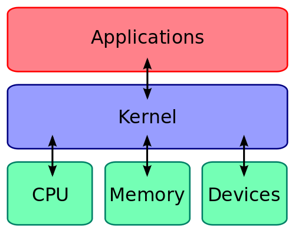

# KERNEL
The kernel is a program inside the **operational system** that has a control over the all system and gives a safe access to the hardware, supervising the process and the organizzation of every data of the computers, the kernel is the **interface between hardware (RAM, CPU ...) and software (applications, web browser ...)** and because of this is the first program to be load and the last program to be closed\
 \
the kernel is responsable for managing and allocating computer resources, allow other applications and programs to use these resources. 
The main tasks of a kernel are: **process management**, **memory management**, **input and output communication management**, **management of hardware components** 

## Structure
The kernel has always the same structures and consist of severals layers 
1. layer: there is the **interface with the hardware**.
2. layer: there is **memory management** responsible for the distribution of RAM.
3. layer: there is **process management** (scheduler) which deals with **time managemnet** and thus enables multitasking.
4. layer: **management of devices**.
5. layer: **file system** here, processes are assigned to their respective areas on the main memory or hard disk.

All this process is done in the background, the kernel is not the ISA because ISA are the istruction that the CPU can do instead the kernel tell the cpu what do and this process bring a better organization and performance  

# Type of kernel 
there are four categories of kernel 
- **kernel monolitici** 

  Is a single enity that manages all the function of the operating system, such as memory management, process management and comunication between the various hardware components. This kind of kernel is very fast 
- **microkernel**

  The microkernel is designed to be as small as possible, delegating many of its functions to external modules operating is 'userpace'. This approach reduces the compleity of the kernel and increases stability, however comunication between the various modules may be slower.  
- **kernel ibrido**

  Combines elements of monolithic kernels and microkernels.
- **esokernel** 

  focuses on etremely low resources managements
- **nanokernel**
  
  give direct access to the hardware 

## links

- https://weblab.ing.unimore.it/people/andreoli/didattica/sistemi-operativi/2020-21/19-scheduling-processi-linux/19-scheduling-processi-linux.pdf

- https://en.wikipedia.org/wiki/Round-robin_scheduling

- https://www.geeksforgeeks.org/program-for-round-robin-scheduling-for-the-same-arrival-time/

- https://medium.com/@francescofranco_39234/round-robin-scheduling-algorithm-8d65128d96db

- C:/Users/antonio/Downloads/ssrn-3351812.pdf
